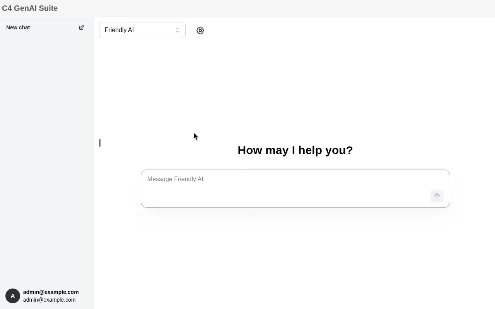
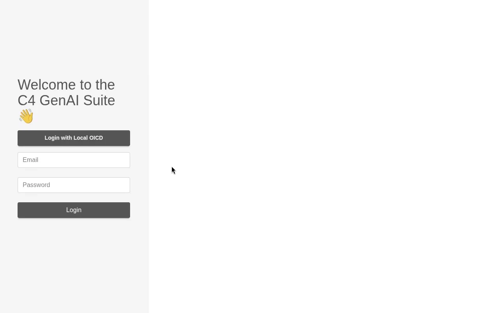

# c4 GenAI Suite

An AI chatbot application with Model Context Provider (MCP) integration, powered by Langchain and compatibility for all major Large Language Models (LLMs) and Embedding Models.

Administrators can create assistants with different capabilities by adding extensions, such as RAG (Retrieval-Augmented Generation) services or MCP servers. The application is built using a modern tech stack, including React, NestJS, and Python FastAPI for the REI-S service.

Users can interact with assistants through a user-friendly interface. Depending on the assistant's configuration, users may be able to ask questions, upload their own files, or use other features. The assistants interact with various LLM providers to provide responses based on the configured extensions. Contextual information provided by the configured extensions allows the assistants to answer domain-specific questions and provide relevant information.

The application is designed to be modular and extensible, allowing users to create assistants with different capabilities by adding extensions.



## Features

### Large Language Models (LLM) and Multimodal Models

The c4 GenAI Suite supports already many models directly. And if your preferred model is not supported already, it should be easy to write an extension to support it.

* OpenAI compatible models
* Azure OpenAI models
* Bedrock models
* Google GenAI models
* Ollama compatible models

### Retrieval Augmented Generation (RAG)

The c4 GenAI Suite includes REI-S, a server to prepare files for consumption by the LLM.

* REI-S, a custom integrated RAG server
  * Vector stores
    * pgvector
    * Azure AI Search
  * Embedding models
    * OpenAI compatible embeddings
    * Azure OpenAI embeddings
    * Ollama compatible embeddings
  * File formats:
    * pdf, docx, pptx, xlsx, ...
    * audio file voice transcription (via Whisper)

### Extensions

The c4 GenAI Suite is designed for extensibility. Writing extensions is easy, as is using an already existing MCP server.

* Model Context Protocol (MCP) servers
* Custom systemprompt
* Bing Search
* Calculator


## Getting Started

### Using Docker-Compose

- Run `docker compose up` in the project root.
- Open the [application](http://localhost:3333) in a browser. The default login credentials are user `admin@example.com` and password `secret`.



### Using Helm & Kubernetes

For deployment in Kubernetes environments, please refer to the [README of our Helm Chart](./helm-chart/README.md).

### Setting up Assistants and Extensions

The c4 GenAI Suite revolves around *assistants*.
Each assistant consists of a set of extensions, which determine the LLM model and which tools it can use.

- In the admin area (click the username on the bottom left), go to the [assistants section](http://localhost:3333/admin/assistants).
- Add an assistant with the green `+` button next to the section title. Choose a name and a description.
- Select the created assistant and click the green `+ Add Extension`.
- Select the model and fill in the credentials.
- Use the `Test` Button to check that it works and `save`.

Now you can return to the [chat page](http://localhost:3333/chat) (click on `c4 GenAI Suite` in the top left) and start a new conversation with your new assistant.

> [!TIP]
> Our `docker-compose` includes a local Ollama, which runs on the CPU. You can use this for quick testing. But it will be slow and you probably want to use another model. If you want to use it, just create the following model extension in your Assistant.
> * Extension: `Dev: Ollama`
> * Endpoint: `http://ollama:11434`
> * Model: `llama3.2`

### Model Context Protocol (MCP) [optional]

Use any MCP server offering an `sse` interface with the `MCP Tools` Extension (or use our `mcp-tool-as-server` as a proxy in front of an `stdio` MCP server).
Each MCP server can be configured in detail as an extension.

### Retrieval Augmented Generation (RAG) / File Search [optional]

Use our RAG server `REI-S` to search user provided files. Just configure a `Search Files` extension for the assistant.
This process is described in detail in [the `services/reis` subdirectory](services/reis/#example-configuration-in-c4).

## Contributing & Development

* See [CONTRIBUTING.md](CONTRIBUTING.md) for guidelines on how to contribute.
* For developer onboarding, check [DEVELOPERS.md](DEVELOPERS.md).

## Main Building Blocks

The application consists of a **Frontend** , a **Backend**  and a **REI-S**  service.

```
┌──────────┐
│   User   │
└─────┬────┘
      │ access
      ▼
┌──────────┐
│ Frontend │
└─────┬────┘
      │ access
      ▼
┌──────────┐     ┌─────────────────┐
│ Backend  │────►│      LLM        │
└─────┬────┘     └─────────────────┘
      │ access
      ▼
┌──────────┐     ┌─────────────────┐
│  REI-S   │────►│ Embedding Model │
│          │     └─────────────────┘
│          │
│          │     ┌─────────────────┐
│          │────►│  Vector Store   │
└──────────┘     └─────────────────┘
```


### Frontend

The frontend is built with React and TypeScript, providing a user-friendly interface for interacting with the backend and REI-S service. It includes features for managing assistants, extensions, and chat functionalities.

> Sources: `/frontend`

### Backend

The backend is developed using NestJS and TypeScript, serving as the main API layer for the application. It handles requests from the frontend and interacts with llm providers to facilitate chat functionalities. The backend also manages assistants and their extensions, allowing users to configure and use various AI models for their chats.

Additionally, the backend manages user authentication, and communicates with the REI-S service for file indexing and retrieval.

For data persistence, the backend uses a **PostgreSQL** database.

> Sources: `/backend`

### REI-S

The REI-S (**R**etrieval **E**xtraction **I**ngestion **S**erver) is a Python-based server that provides basic RAG (Retrieval-Augmented Generation) capabilities. It allows for file content extraction, indexing and querying, enabling the application to handle large datasets efficiently. The REI-S service is designed to work seamlessly with the backend, providing necessary data for chat functionalities and file searches.

The REI-S supports Azure AI Search and pgvector for vector storage, allowing for flexible and scalable data retrieval options. The service can be configured using environment variables to specify the type of vector store and connection details.

> Sources: `/services/reis`
