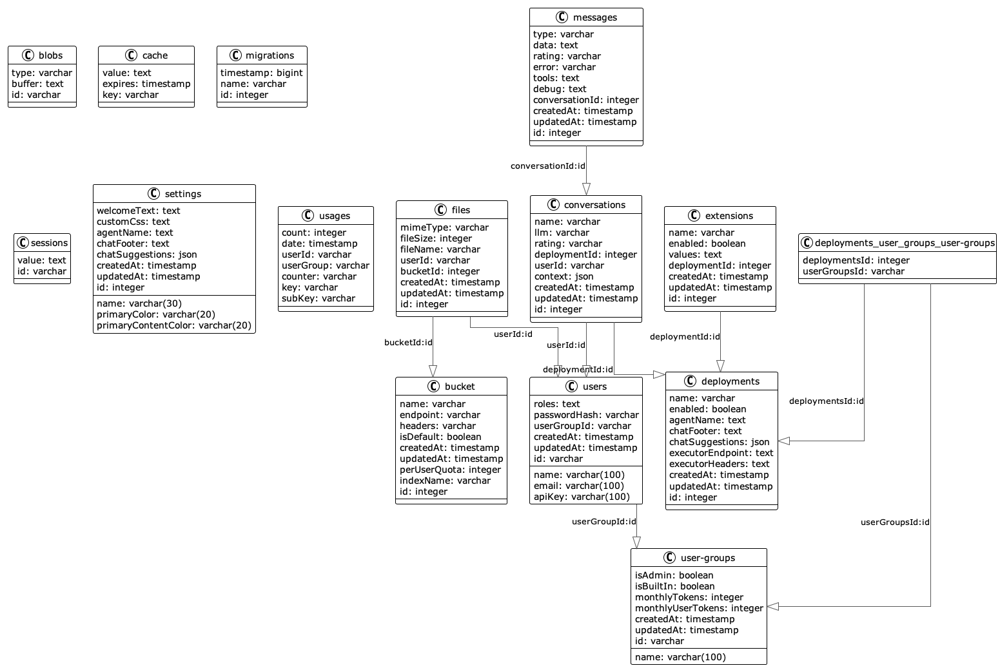

# Database

## Technologies
- [Postgres/Pgvector](https://github.com/pgvector/pgvector)
- [TypeORM](https://docs.nestjs.com/techniques/database)

## Schema

## Migrations
Migrations are used to synchronize the backend entities with the postgres database.

If handled correctly this prevents data loss which would be a side effect when using the TypeORM auto-sync feature.

Migrations are located in the folder src/migrations and executed at runtime during NestJS bootstrap.
