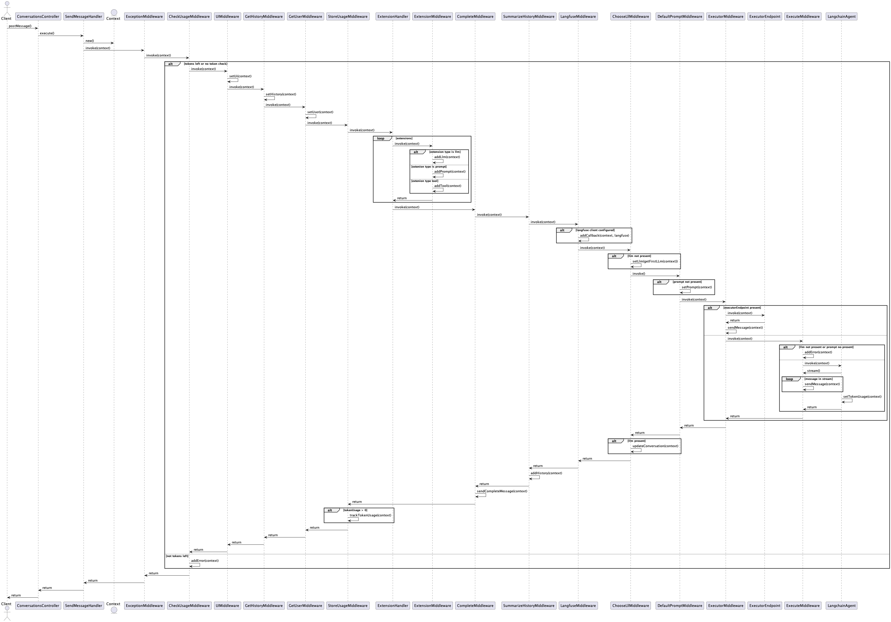
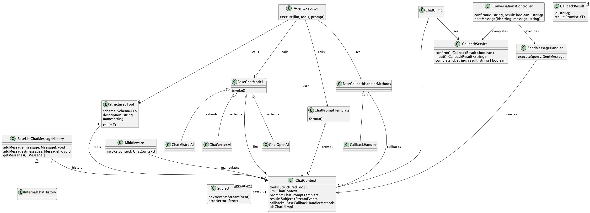

# Messaging

## Technologies
- [NestJS Controller](https://docs.nestjs.com/controllers)
- [CQRS](https://docs.nestjs.com/recipes/cqrs)
- [Server Sent Events](https://docs.nestjs.com/techniques/server-sent-events)

## Patterns
- [CommandBus (CQRS)](patterns/CommandBus.md)
- [Middleware (custom)](patterns/Middleware.md)

## Message Handling
There are two types of middleware which are used to process incoming messages
* Default Middlewares which are static and always called in a specific order
* Extension Middlewares which are dynamically configured and attached within the default middlewares

### Default Middleware

#### ExceptionMiddleware
- catches all errors happending during the middleware calls
- errors are written via the sse socket to the client

#### CheckUsageMiddleware
- checks if the user has enough tokens to use llm

- no token check when:
  - user belongs to `BUILTIN_USER_GROUP_DEFAULT`
  - user belongs to `BUILTIN_USER_GROUP_ADMIN`
  - user has no group
  - user group `monthlyTokens` is lower 0
  - user group `monthlyUserTokens` is lower 0

- throws error if not enough tokens are present

#### UIMiddleware
- sets a callback handler to write ui specific messages to the sse socket

#### GetHistoryMiddleware
- adds the history to the context

#### GetUserMiddleware
- extends the user data in the context

#### LangfuseMiddleware
- adds callback handler to context

#### ChooseLllMiddleware
- when no llm is present in context it sets the first given of the llms

#### DefaultPromptMiddleware
- adds a prompt to the context if there is non

#### ExecutorMiddleware
checks executorEndpoint
- if defined sends request it to the endpoint
- if not defined calls execute middleware

#### ExecuteMiddleware
- uses the context to send commands to the langchain agent
- streams langchain results to the sse socket

#### UpdateLllMiddleware (based on ChooseLllMiddleware)
- when no llm is present returns immediately
- when llm is present updates conversation with llm

#### SummarizeHistoryMiddleware
- updates conversation with history

#### CompleteMiddleware
- sents token usage to the sse socket

#### StorageUsageMiddleware
- tracks the token usage and writes it to the db

### Extension Middleware

#### Llm middleware
- adds llm to context

#### Tool middleware
- adds tools to context

#### Prompt middleware
- adds prompts to context

## Message processing

## Message Context

