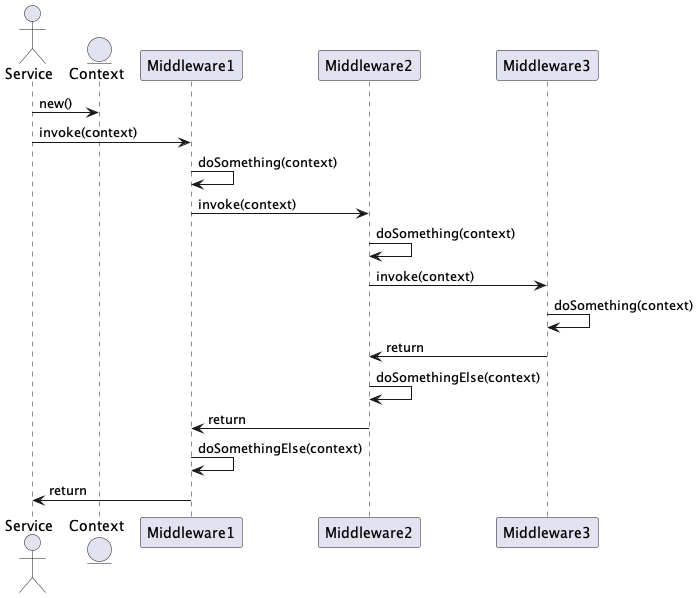

## Middleware
Middlewares are used to chain functions and intercept each chained function call.

The following schematic shows a sequence of function calls how these middlewares interact with each other.

